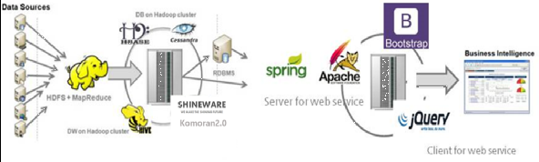

# Watcher
## 목차
* [1. 프로젝트명](#index1)
* [2. 작품명](#index2)
* [3. 작품 소개](#index3)
* [4. 작품 구성도](#index4)
* [5. 작품의 개발배경 및 필요성](#index5)
* [6. 작품의 특장점](#index6)
* [7. 작품 기능](#index7)
* [8. 작품의 기대효과 및 활용분야](#index8)
- - -
### 1. 프로젝트명
* [빅데이터] 하둡 기반의 SNS 크롤링 데이터 분석 시스템
### 2. 작품명
* 빅데이터 기반의 범죄 예측 시스템 Watcher
### 3. 작품 소개
* Watcher란 범죄 및 기상 데이터와 SNS 데이터를 활용하여 범죄율 예측, 국가별 범죄 키워드를 한 눈에 요약하여 보여주는 하둡 기반의 범죄 정보 분석 시스템
* 범죄 통계 및 기상 데이터 분석을 통해 월별/행정구역별 예측 범죄율을 제공
* SNS 트위터 데이터를 활용하여 국가별 범죄 관련 핫키워드를 시각화하여 제공
### 4. 작품 구성도

### 5. 작품의 개발배경 및 필요성
* 최근 '묻지마 범죄', '여성혐오 범죄' 등의 예측할 수 없는 범죄 문제가 대두되었음
* 국내에서 발생했던 범죄 정보를 행정구역별로 쉽게 볼 수 있는 서비스가 부족함
* 범죄 관련 정보를 시각화하여 제공함으로써 범죄를 대비하고 막연한 불안감 해소
### 6. 작품의 특장점
* 수많은 범죄 예측 관련 논문이 있지만 실제 프로그램으로 구현된 사례는 적음
* 접근성이 높은 웹을 통하여 보다 쉽게 범죄 관련 정보를 확인할 수 있음
* SNS 집단지성을 이용하여 민간인들의 범죄에 대한 인식도를 측정할 수 있음
### 7. 작품 기능
* SNS 데이터 크롤러를 이용한 SNS 게시글 텍스트 데이터 수집 및 저장
* 외부 라이브러리를 활용한 한국어 형태소 분석 및 명사 데이터 추출
* HiveQL로 작성된  Map-Reduce Job을 통해 범죄 키워드 추출 및 데이터 가공
* 하둡과 Hive-Java Thrift Client 연동을 통한 데이터 분산 저장 및 처리, RDBMS 적재
* 다중회귀분석 알고리즘을 적용하여 월별 5대 범죄별 범죄율 예측
* 행정구역별 5대 범죄 발생 확률, 전년 데이터 차트 등을 지도 위에 시각화하여 제공
* 기온, 습도 등의 종속변수 변화에 따른 범죄율 증감 시뮬레이션 제공
* 한국, 일본, 러시아, 미국, 독일, 프랑스의 범죄 관련 키워드 순위 제공
### 8.작품의 기대효과 및 활용분야
* 월/행정 구역별 범죄율 예측, 정보 제공을 통하여 범죄에 대한 대비 및 경각심 고취
* 일일/시,군,구 단위의 범죄 데이터 확보 시 범죄 발생 확률에 따른 일일 범죄 지수 제공 및 경찰의 순찰 활동의 우선순위, 중점 관리 구역 선정 가능
### 시연 동영상
* [https://youtu.be/RDptlpjit3E](https://youtu.be/RDptlpjit3E)
